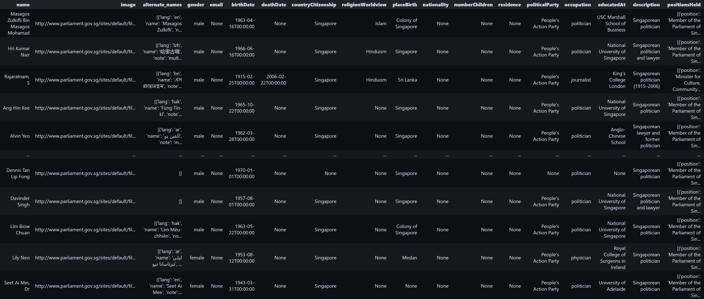

# PoliticianData

|  | <div align="center"><span style="font-size: large;">**Everypolitician enriched w/ Wikidata.<br><br>Separated by countries.<br><br>Ingested into Elasticsearch.**</span></div> |
| --- | --- |

This project is part of PopFigExpert.
1. Takes EveryPolitician data, from Australia, China, India, Indonesia, Japan, Malaysia, Singapore and Vietnam.
>These countries were chosen because they were found as countries in my scraped mfa-press statements. See [MFA-PressData](https://github.com/mfa-press/mfa-press).


2. Enriches the data with Wikidata.
> Augment Everypolitician with countryCitizenship, nationality, religion, number of children, residence, political party, occupation, educated at, description and positionsHeld.


3. Separates the data by country.
> `['country'].json`. Separation facilitates more targeted searches, because I doubt anyone needs the exact same selection for all countries.


4. Ingest into Elasticsearch.
> Ingested into one `/profile` index.


## Data Structure:

### Typescript
```typescript
export type ProfileSearchResult = {
  name?: string;
  alternateNames?: string[];
  gender?: string;
  email?: string;
  birthDate?: string;
  deathDate?: string;
  placeBirth?: string;
  countryCitizenship?: string;
  nationality?: string;
  religionWorldview?: string;
  numberChildren?: number;
  residence?: string;
  politicalParty?: string;
  occupation?: string;
  educatedAt?: string;
  image?: string;
  description?: string;
  positionsHeld?: [
    {
      position?: string;
      startDate?: string;
      endDate?: string;
      replaces?: string;
      replacedBy?: string;
    },
  ];
};
```

### Elasticsearch index Mappings
```python
index_mappings = {
  "mappings": {
    "properties": {
      "name": {"type": "text"},
      "image": {"type": "text"},
      "alternate_names": {"type": "text"},
      "gender": {"type": "text"},
      "email": {"type": "text"},
      "birthDate": {"type": "text"},
      "deathDate": {"type": "text"},
      "countryCitizenship": {"type": "text"},
      "religionWorldview": {"type": "text"},
      "placeBirth": {"type": "text"},
      "nationality": {"type": "text"},
      "numberChildren": {"type": "long"},
      "residence": {"type": "text"},
      "politicalParty": {"type": "text"},
      "image": {"type": "text"},
      "occupation": {"type": "text"},
      "positionHeld": {"type": "text"},
      "educatedAt": {"type": "text"},
      "dateBirth": {"type": "text"},
      "description": {"type": "text"},
      "positionsHeld": {"type": "nested",
        "properties": {
          "position": {"type": "text"},
          "startDate": {"type": "text"},
          "endDate": {"type": "text"},
          "replaces": {"type": "text"},
          "replacedBy": {"type": "text"}
        }
      }
    }
  }
}
```

## Dependencies

The notebook requires the following dependencies:

- Python 3.x
- Jupyter Notebook
- Pandas
- Requests
